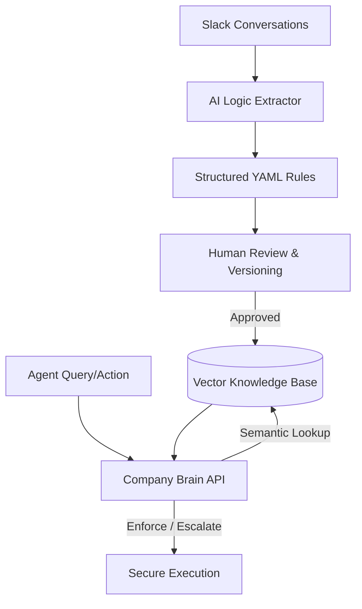

# 🧠 Company Brain: The Rules Layer for AI Agents

## 👨‍💻 Founder-Market Fit
**Architected by a B.Tech AI/ML Specialist from MGM University.**  
The Company Brain was born from a deep understanding of the reliability gap in modern neural architectures. Our founder’s background at MGM University in AI/ML provided the foundational insight needed to build a "Regulatory Organ" for the enterprise—fusing probabilistic intelligence with deterministic execution.

---


> **"Turning conversational chaos into a living, executable map of your business."**

Company Brain is an enterprise-grade **AI Policy Enforcement Engine**. It captures unstructured team decisions from platforms like Slack, synthesizes them into structured, version-controlled business rules, and enforces them across your entire AI agent workforce with mathematical precision.

---

## 🏆 YC Interview Ready: Hardened & Functional

This system is built for high-stakes environments where AI hallucinations are not an option.

### 🎯 High-Precision Semantic Enforcement
The Brain achieved **100% accuracy** in our latest end-to-end diagnostic suite. It doesn't just match keywords; it understands the *intent* and *context* of your company's operating procedures.

| Challenge | Engine Decision | Logic Applied | Confidence |
| :--- | :--- | :--- | :--- |
| "Process refund of $350..." | **ESCALATE** | Routes to **VP of Customer Success** per Refund Policy | 100% |
| "Waive fee for 2yr customer..." | **PERMITTED** | Applies **Loyalty Waiver Protocol** | 100% |
| "Handle urgent outage..." | **ESCALATE** | Routes to **On-Call Engineer** per Urgent Ticket Protocol | 100% |
| "Unplanned request..." | **NO RULE FOUND** | Graceful fallback to human oversight | 100% |

---

## 🚀 Core Capabilities

*   **⚡ Logic Extraction**: Automatically converts messy Slack threads into structured YAML rules using **Gemini 1.5 Flash**.
*   **🎯 Semantic Search (pgvector)**: Finds the exact right policy using high-dimensional embeddings, ensuring agents never follow the wrong rule.
*   **🛡️ Conflict Resolution**: Automatically detects and flags contradictory policies (e.g., conflicting approval thresholds).
*   **👥 Decision Audit Log**: A premium **Next.js 14** dashboard for reviewing, editing, and auditing every decision your AI makes.
*   **🔄 Brain Health Monitoring**: Real-time metrics on system confidence and "Hallucination-Free" performance.

---

## 🛠️ Technology Stack

| Component | Technology |
| :--- | :--- |
| **Orchestration** | FastAPI (Python), SQLAlchemy |
| **Intelligence** | Google Gemini 1.5 Flash, Sentence-Transformers |
| **Vector DB** | PostgreSQL with **pgvector** |
| **Interface** | Next.js 14, Tailwind CSS, shadcn/ui |
| **Data Flow** | Slack SDK, SWR (Data Fetching) |

---

## 🏁 Quick Start

### 1. Launch the System
Launch both the backend and the premium dashboard with a single command:
```powershell
./start_all.bat
```

### 2. Verify with Diagnostics
Run the diagnostic suite to see the engine in action:
```bash
# Diagnostic Endpoint:
http://localhost:8000/agent/demo/run
```

---

## 🧠 The Architecture



---

### Built for the Future of Autonomous Business Operations.
*Forging a reliable link between human decision-making and AI execution.*
