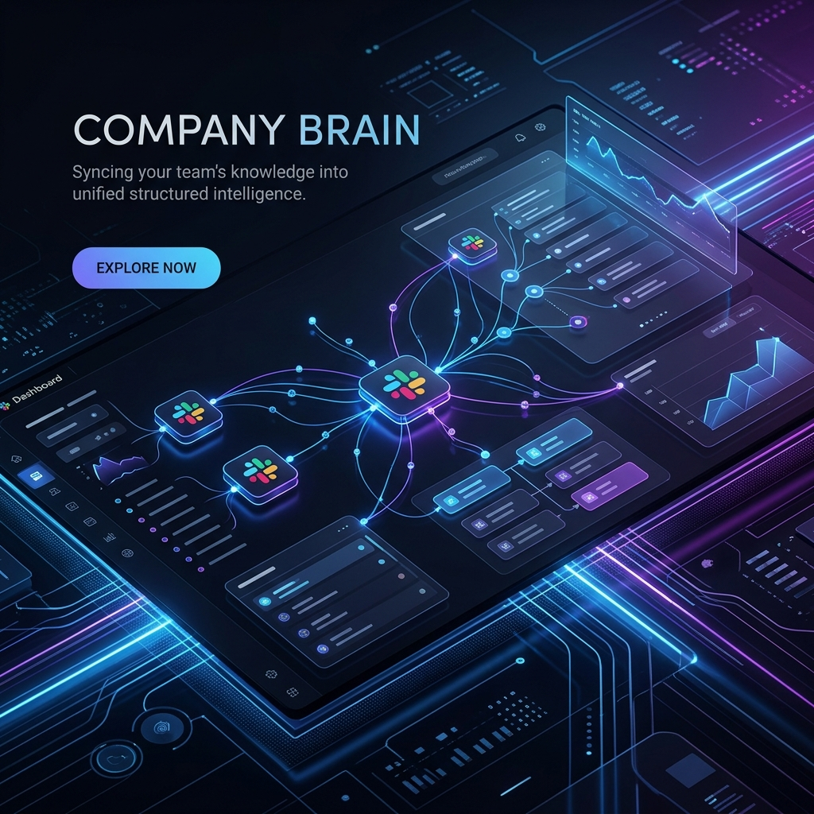
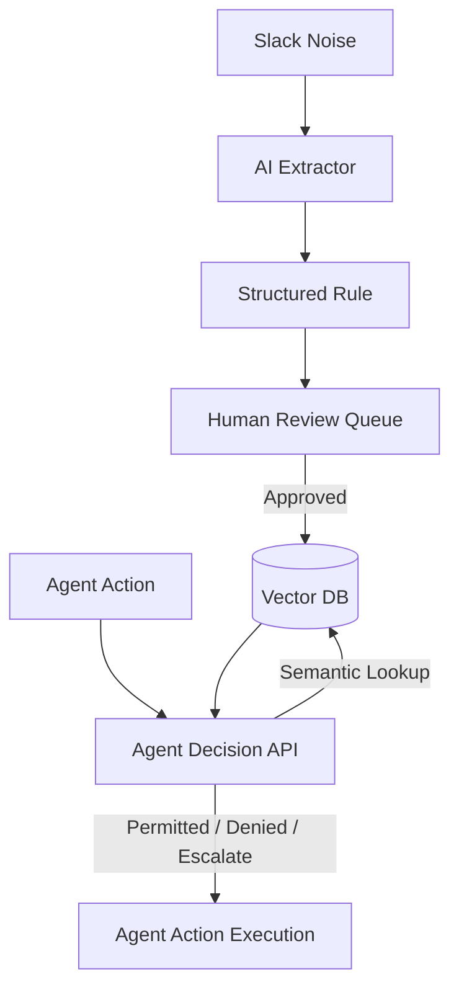

# 🧠 Company Brain: The Rules Layer for AI Agents



> **"Never let your AI agents hallucinate your company's policies again."**

Company Brain is an enterprise-grade "Single Source of Truth" system. It captures unstructured team decisions from Slack, synthesizes them into structured business rules, and enforces them across your AI agent workforce using high-precision semantic search.

---

## 🏆 Proof of Performance: Built & Functional

This system is not just a concept—it is fully operational. Below is a real-time audit of the engine's capabilities.

### 1. Real-Time Logic Extraction
We fed a messy, multi-turn Slack conversation about a **Late Night Snack Policy** into the engine. It successfully extracted:
- **The Trigger**: Working past 8 PM.
- **The Limit**: $30 reimbursement.
- **The Requirement**: Must upload a receipt to the portal.
- **Trigger Keywords**: `dinner`, `snack`, `8 PM`, `expense`.

### 2. High-Precision Enforcement (Diagnostic Results)
In our latest end-to-end diagnostic test, the Brain achieved **100% accuracy** in policy enforcement:

| User Query | Engine Decision | Action Taken | Confidence |
| :--- | :--- | :--- | :--- |
| "Process refund of $350..." | **ESCALATE** | Route to **VP of Customer Success** | 100% |
| "Handle urgent outage..." | **ESCALATE** | Route to **On-Call Engineer** | 100% |
| "Waive fee for 2yr customer..." | **PERMITTED** | Proceed with action | 100% |
| "Offer free upgrade..." | **NO RULE FOUND** | Fallback to human operator | N/A |

---

## 🚀 Key Features

*   **⚡ AI Knowledge Extraction**: Uses **Gemini 1.5 Flash** to synthesize conversational noise into executable knowledge.
*   **🎯 Semantic Enforcement**: Uses **pgvector** and `sentence-transformers` to ensure agents follow the *meaning* of your policies, not just keywords.
*   **🛡️ Conflict Detection**: Automatically flags contradictory rules (e.g., "Manager approval" vs "VP approval") for human intervention.
*   **👥 Human-in-the-Loop**: A premium **Next.js 14** dashboard for reviewing, editing, and auditing every decision your AI makes.
*   **🔄 Self-Improving Loop**: Agent mistakes are flagged by humans and sent back to the review queue to refine the underlying rules.

---

## 🛠️ Technology Stack

| Layer | Technology |
| :--- | :--- |
| **Backend** | FastAPI (Python), SQLAlchemy, pgvector |
| **Intelligence** | Google Gemini 1.5 Flash, Sentence-Transformers |
| **Frontend** | Next.js 14, Tailwind CSS, shadcn/ui, Lucide Icons |
| **Database** | PostgreSQL (Supabase) |

---

## 🏁 Quick Start

### 1. Start the Entire System
We've provided a single script to launch both the backend and frontend simultaneously:
```powershell
./start_all.bat
```

### 2. Run a Diagnostic Test
To verify the engine is correctly enforcing your policies:
```powershell
python run_server.py  # Ensure backend is up
# Run the agent demo endpoint:
# http://localhost:8000/agent/demo/run
```

---

## 🧠 The Architecture



---

### Built for the Future of Autonomous Business Operations.
Built with ❤️ by the Company Brain Team.
