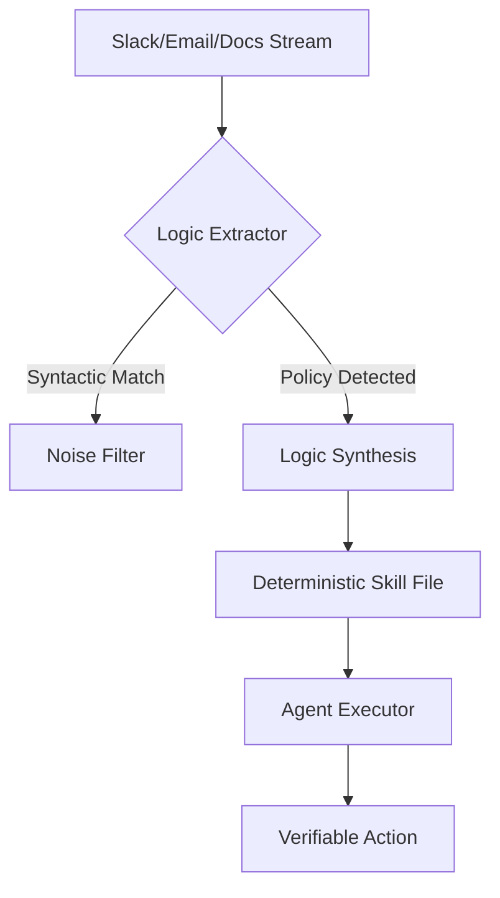
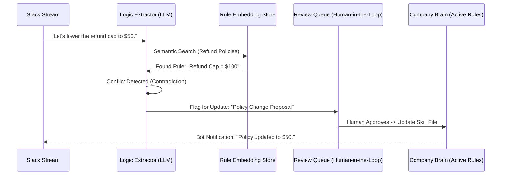

# Technical Briefing: The "Company Brain" Architecture
## From Probabilistic RAG to Deterministic Skill Execution

**Role:** Principal AI Infrastructure Architect / YC S26 Group Partner
**Subject:** Building the Deterministic Logic Layer for the Autonomous Enterprise

---

### 1. The RAG Fallacy vs. Logic Extraction

Traditional RAG (Retrieval-Augmented Generation) is a **probabilistic** lookup. When an agent asks, "What is our refund policy?", RAG finds a document that *looks like* a refund policy and hopes the LLM synthesizes it correctly. This is insufficient for autonomous agents because:
- **Ambiguity:** Conversational data (Slack) often contains conflicting or outdated instructions.
- **Syntactic Noise:** "I think we should do X" is not a policy; "Effective today, all X must do Y" is.
- **Lack of State:** RAG doesn't know if a rule has been superseded by a newer message.

**The "Brain" Approach: Semantic Logic Extraction**
Instead of retrieving text, we build a pipeline that treats communication as a stream of **State Mutations**.



---

### 2. The "Skills File" Specification (YAML)

A "Company Skill" is a version-controlled, executable unit of business logic. It transforms unstructured chat into a structured DAG (Directed Acyclic Graph) of actions.

```yaml
skill_id: "fin-refund-001"
name: "Customer Refund Policy"
version: "2.1.0"
source_provenance:
  - type: "slack_thread"
    id: "C01ABC23-1683052800.001"
    author: "@finance_lead"
    timestamp: "2024-05-03T10:00:00Z"

trigger:
  intent: "process_refund"
  entities: ["amount", "customer_id", "reason"]
  conditions:
    - "context.channel == 'support-tier-1'"

logic_engine:
  steps:
    - id: "validate_amount"
      action: "math.compare"
      input: "{{amount}}"
      threshold: 50.00
      on_true: "auto_approve"
      on_false: "escalate_to_manager"

    - id: "auto_approve"
      action: "stripe.issue_refund"
      params: { "id": "{{customer_id}}", "amt": "{{amount}}" }
      
    - id: "escalate_to_manager"
      action: "slack.send_approval_request"
      params: { "role": "Finance_Manager", "data": "{{context}}" }

guardrails:
  max_value: 500.00
  restricted_regions: ["VAT_EXEMPT_ZONE"]
  human_in_the_loop: "always_if_failed_validation"
```

---

### 3. Self-Healing Architecture: The "Policy Drift" Loop

The "Brain" must detect when tribal knowledge changes. If a VP says "New refund cap is $50" in `#ops`, the system must identify this as a contradiction to the existing `$100` rule.



---

### 4. Auditability: The "Chain of Truth"

To maintain 100% hallucination-free results, every agent decision must have a `trace_id` pointing back to the raw communication.

**Database Schema (Conceptual):**
| Field | Type | Description |
| :--- | :--- | :--- |
| `decision_id` | UUID | Primary key for the agent's action. |
| `rule_id` | UUID | Reference to the deterministic rule used. |
| `source_ref` | JSONB | `{ "type": "slack", "ts": "...", "channel": "..." }` |
| `logic_snapshot` | Text | The exact YAML step executed. |
| `raw_evidence` | Text | Snippet of the Slack message that formed the rule. |

**Audit Query:**
`SELECT raw_evidence FROM brain_decisions WHERE decision_id = '...'`
*Result: "Per @jessica in #finance at 10:45 AM: 'We are now requiring receipts for all returns.'"*

---

### 5. Scaling to the Autonomous Enterprise

The "Brain" acts as the **Central Nervous System**. Individual agents (Support, Eng, HR) do not hold their own policies; they query the Brain for "Permission to Act."

1.  **Support Agent:** "Can I refund this user?" -> **Brain:** "Rule 402 says YES if under $50."
2.  **Engineering Agent:** "Can I deploy to prod?" -> **Brain:** "Rule 109 says NO during freeze period (Source: #dev-announcements)."
3.  **HR Agent:** "What's the travel budget?" -> **Brain:** "Rule 88 says $200/day (Source: Employee Handbook v2)."

**Scaling Strategy:**
- **Decentralized Capture:** Bots in every channel.
- **Centralized Reasoning:** A single source of truth for "Current State."
- **Immutable Audit:** A ledger of every rule change and agent execution.

---

### Implementation Roadmap for YC S26

- **Phase 1:** Connector layer (Slack/GSuite ingestion).
- **Phase 2:** Semantic contradiction detection (Cross-referencing new messages vs. stored rules).
- **Phase 3:** Skill Generation (Automated YAML drafting).
- **Phase 4:** Agent API (The `/ask-brain` endpoint for external tools).
